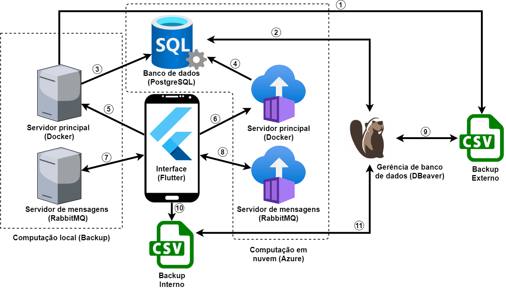
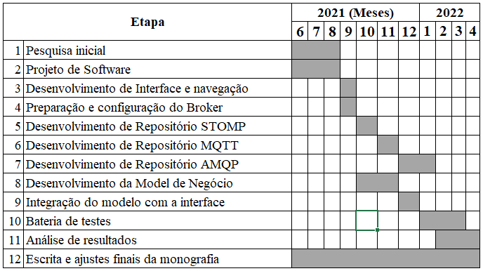

# Análise do desempenho de protocolos para Computação em névoa

### Equipe: 
1834134 José Vitor Moreno josemoreno@alunos.utfpr.edu.br (41) 3672-4602 \
906867 Luís Henrique Beltrão Santana luis.2012@alunos.utfpr.edu.br (41) 99690-4570

### Professores Orientadores:
Profª. Drª. Ana Cristina B. Kochem Vendramin \
Prof. Dr. Daniel Fernando Pigatto

## Resumo

Com o avanço do poder de processamento e a miniaturização dos processadores mo-dernos, a cada ano que se passa, vê-se cada vez mais dispositivos portáteis se tornando popula-res no Brasil. Esses dispositivos se utilizam de sistemas embarcados onde o consumo de recur-sos como bateria, processamento e memória, que são escassos, são de vital importância para que o usuário tenha uma boa experiência de uso. Atualmente, os dispositivos móveis são uma grande fonte de geração de dados. Esses dados ficam situados nas bordas da rede, sendo mui-tas vezes inviável tentar centralizá-los. A camada de computação em névoa surgiu como um meio de prover serviços de armazenamento e comunicação entre a computação em nuvem e os dispositivos finais (IoT - Internet of Things), podendo fornecer dados em tempo real de forma descentralizada e escalável.  Um elemento chamado servidor de mensagens fica responsável por gerenciar e distribuir a informação através de um ou mais canais de comunicação, de modo a demandar menos recursos computacionais com requisições repetidas para uma mesma infor-mação. Este trabalho visa analisar alguns protocolos de comunicação para computação em né-voa, como MQTT (Message Queuing Telemetry Transport), AMQP (Advanced Message Queuing Protocol) e STOMP (Simple Text Orientated Messaging Protocol) por meio de um servidor de mensagens RabbitMQ. O objetivo é analisar como esses protocolos se comportam nesse novo mundo desafiador de recursos escassos, que são autogerenciados por ferramentas internas do Sistema Operacional. 

### Palavras-chave: 

Computação em névoa, Dispositivos Móveis, AMQP, STOMP, MQTT.

## 2 DESCRIÇÃO DO PROJETO / CARACTERIZAÇÃO

### 2.1 Objetivo Geral 
Este trabalho tem como objetivo geral realizar uma análise do desempenho da computação em névoa ao utilizar os protocolos STOMP, MQTT e AMQP em dispositivos móveis onde, devi-do às limitações de energia e memória, o sistema operacional pode interferir no funcionamento da interface de rede. 

### 2.2 Objetivos Específicos
Os objetivos específicos desse trabalho são:
* Apresentar os conceitos de computação em névoa, suas vantagens e seus elemen-tos;
* Estudar os protocolos de comunicação STOMP, MQTT e AMQP;
* Analisar o desempenho dos protocolos STOMP, MQTT e AMPQ em relação às métricas: queda de conexão, consumo de memória, processamento e energia;

### 2.3 Diagrama

Figura 1: Diagrama das relações entre as tecnologias \

O diagrama das relações entre tecnologias é mostrado na Figura 1. O dispositivo móvel é o ponto central desta aplicação, não só porque ele faz parte da comunicação que será analisa-da, mas também porque a coordena. Esta comunicação ocorre entre o dispositivo móvel e um servidor de mensagens (broker), sendo que este faz parte da camada de névoa. Essa comuni-cação é representada pela seta de numeração 8.

O RabbitMQ (RabbitMQ) foi escolhido pois, além dos integrantes já terem conhecimen-to sobre seu uso e tê-lo usado em trabalhos anteriores, esse broker tem suporte para todos os protocolos que serão analisados neste trabalho, o que ajuda a evitar divergências nos dados causadas pelo uso de diferentes brokers.
O Docker foi escolhido como servidor central por ser uma ferramenta muito flexível de modo que pode ser construída uma imagem para cada microsserviço e a partir dela levantar um serviço em segundos, sendo assim um sistema que gerencia a execução dos microsserviços. 

O Azure por sua vez é um serviço de nuvem amplamente conhecido e oferece o gerenci-amento de servidores como um serviço o que traz uma grande praticidade para o gerenciamen-to do projeto. Além disso, o Azure oferece um período de testes de um ano gratuito para o desenvolvimento de projetos como uma forma de aprender a usar a plataforma e ambos os autores têm direito a esse benefício.

Os dados de comunicação ficarão temporariamente armazenados na memória interna do dispositivo móvel, em um arquivo do formato CSV. Periodicamente, estes dados armazenados serão enviados para um banco de dados externo que será executado como um microsserviço Docker no servidor de computação em nuvem Azure. As conexões identificadas pelos núme-ros 6 e 4 representam a transmissão referida, onde os dados do arquivo CSV são transmitidos para o “Servidor Principal” e, posteriormente, são salvos em um Banco de dados. 

O banco de dados que será utilizado no projeto será o PostgreSQL, que é um banco de dados relacional robusto e que foi escolhido por uma questão de familiaridade dos autores, que já empregaram esse banco de dados em projetos anteriores.

Como forma de redundância, caso a conexão do dispositivo móvel com os microsservi-ços seja perdida, uma instância local pode ser criada e configurada no aplicativo para permitir que os testes continuem. Neste caso, as conexões representadas pelos números 7, 5 e 3 substi-tuem as conexões 8, 6 e 4, respectivamente.

Como forma de redundância, um segundo arquivo de backup CSV, gerado a partir do banco de dados, periodicamente será armazenado em outro servidor na nuvem. Esta conexão é representada pelo número 9. Em caso de queda de conexão com a instância principal do servi-dor, tratada anteriormente, a conexão 9 será substituída pela conexão de número 1.

Os dados salvos no banco de dados e nos dois arquivos CSV serão sincronizados pela ferramenta DBeaver, que permite conectar, gerenciar e migrar dados entre diversos bancos de dados e meios de armazenamento de informação como CSV. As conexões do DBeaver são apresentadas na Figura 1 pelos números 11, 9 e 2.

O Flutter é um novo framework da Google que permite desenvolver a interface gráfica e a lógica de negócio que podem ser usadas para criar aplicações para Android e iOS com um único código base, de modo que os códigos nativos são autogerados.

Para a realização dos testes relativos à memória, processamento e energia as plataformas Android e iOS possuem ferramentas que permitem analisar essas características durante a exe-cução da aplicação.

## 3 MOTIVAÇÃO E RESULTADOS ESPERADOS

### 3.1 Motivação/Justificativa Resumida 

Um dos autores deste trabalho utilizou o protocolo STOMP em uma startup onde ele trabalhava. Após a aquisição de dispositivos mais modernos pela startup, observaram-se que-das frequentes de conexão neles, criando uma intermitência da ordem de segundos na época. Devido a esse problema, surgiu o interesse por parte dos autores de estudar o comportamento de alguns protocolos de comunicação para computação em névoa. O objetivo do estudo é des-cobrir como esses protocolos se comportam em um cenário de quedas de conexão frequentes, onde o sistema operacional faz um gerenciamento de qual processo pode usar o adaptador de rede e qual deve ser momentaneamente bloqueado.

Com a grande demanda na indústria por dispositivos conectados à rede, os dados estão sendo gerados nas bordas da rede em quantidades cada dia maiores (AZEVEDO, 2017), o que muitas vezes inviabiliza centralizar essa grande demanda em um único servidor. Por esse motivo, a computação em névoa se torna uma grande aliada na tarefa de tratar essas informa-ções.

A camada de névoa está situada entre a nuvem e a IoT. Com a computação em névoa tem-se uma plataforma distribuída e altamente virtualizada, onde a informação geralmente está situada nas bordas da rede, podendo também centralizar alguns dados na nuvem.

Dessa forma, a camada de névoa é um meio de prover serviços de armazenamento e co-municação entre a nuvem e os dispositivos finais, podendo fornecer dados em tempo real de forma descentralizada e escalável (COUTINHO, CARNEIRO, GREVE, 2016).

Como é necessário que haja confiabilidade nos dispositivos que compõe uma rede de computação em névoa, este trabalho visa analisar o comportamento dos protocolos de comuni-cação AMQP, MQTT e STOMP em dispositivos móveis com relação ao uso de recursos escas-sos como energia, processamento e memória.

### 3.2 Resultados Esperados

Com este trabalho espera-se encontrar qual dos três protocolos analisados apresenta o melhor desempenho em um dispositivo móvel, usando como métricas o consumo de energia, memória, processamento e a resistência em caso de quedas de conexão. Com esses resultados, pode-se recomendar cada protocolo para diferentes situações com foco em aplicações fim.

## 4 METODOLOGIA E MECANISMOS DE GESTÃO

### 4.1 Metodologia

Nesta seção é apresentado como o projeto será implementado e como se pretende alcan-çar os resultados desejados.

Inicialmente, será realizado um estudo sobre os conceitos básicos presentes neste traba-lho, como: Internet das Coisas, Computação em Nuvem, Computação em Névoa, Modelo pu-blicação/subscrição e servidores de mensagens.

Será feita, também, uma análise de estudos e trabalhos correlatos sobre o desempenho dos protocolos AMQP (OASIS, 2012), MQTT (OASIS, 2019) e STOMP (STOMP, 2012) em diferentes tipos de ambientes e arquiteturas. Por exemplo, Luzuriaga et al. (2015) analisou o desempenho dos protocolos AMQP e MQTT em dispositivos móveis. Ross (2019) analisou os protocolos MQTT e CoAP na Computação em Névoa. 

Este tipo de análise possibilitará um entendimento maior sobre o comportamento dos protocolos citados, principalmente com relação a cenários parecidos com os que serão produ-zidos neste trabalho. Assim, será estabelecido um conhecimento geral que ajudará nas previ-sões acerca dos resultados que se pretende obter na fase de testes.

Para poder implementar o projeto de maneira mais organizada, algumas ações serão rea-lizadas antes do desenvolvimento do software, seguindo o que está apresentado no planeja-mento deste trabalho.

O levantamento de requisitos será uma etapa importante para delimitar o escopo do pro-jeto e definir com mais clareza o que deve ser implementado. O conjunto de requisitos funcio-nais e não funcionais também servirá como uma lista de controle no fim da implementação, que indica se o resultado está de acordo com o planejamento inicial.

Assim que os requisitos forem definidos, diagramas serão elaborados para que haja uma melhor representação do funcionamento do trabalho, melhorando a organização e facilitando o entendimento. Essas medidas de planejamento também ajudam a evitar problemas e mudanças em momentos futuros.

No momento em que as etapas anteriores forem concluídas, os recursos necessários serão alocados e a implementação do sistema será iniciada. 

Uma vez que os testes terminarem e os dados forem recolhidos, eles serão organizados e, também, dispostos em estruturas gráficas para facilitar a sua interpretação. Uma análise esta-tística será necessária para poder desenvolver considerações sobre o que foi encontrado nos testes.

No período de “Pesquisas iniciais”, apresentado no cronograma, a escrita da monografia será iniciada. O texto será atualizado conforme as etapas apresentadas no cronograma forem sendo concluídas, caso seja julgado necessário. Após a etapa de “Análise dos resultados”, a monografia deverá ser concluída, onde o restante do texto será finalizado e os últimos ajustes serão feitos.

### 4.2 Análise de Riscos

Os principais riscos para o projeto estão descritos abaixo:

**Risco 1** \
**Importância:** Alta. \
**Descrição:** Morte de um dos alunos. \
**Efeito no Projeto:** Atraso considerável no desenvolvimento. \
**Probabilidade:** Baixa. \
**Impacto:** Alto. \
**Ação: Eliminar:** Ignorar o iOS e focar no Android

**Risco 2** \
**Importância:** Alta. \
**Descrição:** Um dos membros da equipe ficar doente. \
**Efeito no Projeto:** Atraso no desenvolvimento. \
**Probabilidade:** Baixa. \
**Impacto:** Médio. \
**Ação: Eliminar:** Ignorar o iOS e focar no Android.

**Risco 3** \
**Importância:** Alta. \
**Descrição:** Falha da integração da biblioteca AMQP com o Sistema Operacional. \
**Efeito no Projeto:** O protocolo não será analisado. \
**Probabilidade:** Baixa. \
**Impacto:** Médio. \
**Ação: Eliminar:** Foco na análise dos outros protocolos.

**Risco 4** \
**Importância:** Média. \
**Descrição:** Curva de aprendizado das tecnologias envolvidas no projeto. \
**Efeito no Projeto:** Atraso no desenvolvimento. \
**Probabilidade:** Média. \
**Impacto:** Médio. \
**Ação: Mitigar:** Empregar técnicas desenvolvimento ágil e definição clara de cronograma \

**Risco 5** \
**Importância:** Média. \
**Descrição:** A biblioteca de AMQP não ser compatível com os ciclos de vida do Sistema. \
**Efeito no Projeto:** Atraso no desenvolvimento. \
**Probabilidade:** Média. \
**Impacto:** Baixo. \
**Ação: Mitigar:** Desenvolver tratamentos para os ciclos de vida com programação reativa

**Risco 6** \
**Importância:** Média. \
**Descrição:** Mudança de regras de privacidade devido ao lançamento da API 31 do Android e do iOS 15 \
**Efeito no Projeto:** Atraso no desenvolvimento. \
**Probabilidade:** Média. \
**Impacto:** Baixo. \
**Ação: Mitigar:** Adequar a implementação às novas regras de privacidade

**Risco 7** \
**Importância:** Baixa. \
**Descrição:** Queda de internet por mais de um dia. \
**Efeito no Projeto:** Atraso do cronograma. \
**Probabilidade:** Alta. \
**Impacto:** Baixo. \
**Ação: Mitigar:** usar uma instancia local dos servidores.

**Risco 8** \
**Importância:** Baixa. \
**Descrição:** Anomalias de rede durante os testes dos protocolos \
**Efeito no Projeto:** Atraso do cronograma. \
**Probabilidade:** Média. \
**Impacto:** Baixo. \
**Ação: Mitigar:** Fazer diversas baterias de testes para reduzir o problema.

### 4.3 Cronograma, Datas Importantes e Responsabilidades das Ações e Custos

O cronograma simplificado, exibido na seção 4.3.1, aborda os meses em que serão realizadas as etapas descritas na seção 4.1, durante o desenvolvimento do projeto. Na seção 4.3.2 encon-tra-se o cronograma detalhado, com o total de horas dedicadas para cada ação de cada etapa do projeto. 

#### 4.3.1 Cronograma simplificado

| Etapa | Ação                                                                |  Entregável |  Início   | Fim       |  Tempo 
| ----- | ------------------------------------------------------------------- |  ---------- |  -------- | --------- |  ----- 
| 1	    | Pesquisa                                                            |             |  15/06/21 |  19/06/21 |  10h   
| 1	    | Resumo                                                              |   Resumo    |  21/06/21 |  26/06/21 |  12h   
| 1	    | Cronograma                                                          |             |  28/06/21 |  09/07/21 |  24h   
| 1     | Análise de riscos                                                   |             |  14/07/21 |  17/07/21 |   8h   
| 1     | Metodologia                                                         |             |  19/07/21 |  24/07/21 |  12h   
| 2	    | Análise de requisitos		                                          |             |  15/06/21 |  03/07/21 |  40h   
| 2	    | Diagramas UML e design de telas                                     |             |  05/07/21 |  31/08/21 | 100h   
| 3     | Configuração do Projeto e implementação da arquitetura base.        |             |  01/09/21 |  04/09/21 |   8h   
| 3     | Implementação da tela de teste dos protocolos e da regra de negócio |             |  06/09/21 |  11/09/21 |  10h   
| 3     | Implementação da tela de configuração de teste e da regra de negócio|             |  13/09/21 |  18/09/21 |  12h   
| 3     | Implementação da tela de envio de resultados e da regra de negócio  |             |  20/09/21 |  25/09/21 |  12h   
| 4     | Estudo sobre Docker                                                 |         	|  01/09/21 |  11/09/21 |  18h   
| 4     | Configuração do RabbitMQ		                                      |             |  13/09/21 |  18/09/21 |  12h   
| 4     | Configuração do PostgreSQL		                                  |             |  20/09/21	|  25/09/21	|  12h   
| 5     | Integração da biblioteca do Stomp		                              |             |  27/09/21	|  02/10/21	|  12h   
| 5     | Conexão com o servidor de mensagens	                              |             |  04/10/21	|  09/10/21	|  12h   
| 5     | Reconexão                                                           |             |  11/10/21	|  23/10/21	|  20h   
| 6	    | Integração da biblioteca do MQTT		                              |             |  25/10/21	|  30/10/21	|  12h   
| 6	    | Conexão com o servidor de mensagens		                          |             |  01/11/21	|  06/11/21	|  10h   
| 6	    | Reconexão                                                           |             |  08/11/21	|  20/11/21 |  22h   
| 7	    | Integração da biblioteca do AMQP	                                  |             |  22/11/21	|  04/12/21	|  24h   
| 7	    | Conexão com o servidor de mensagens                                 |             |  06/12/21	|  18/12/21	|  24h 
| 7	    | Reconexão                                                           |             |  20/12/21	|  22/01/22	|  46h
| 8	    | Implementação do servidor                                           |             |  27/09/21	|  02/10/21	|  12h
| 8	    | Estudo da tecnologia Flutter                                        |             |  04/10/21	|  23/10/21	|  32h
| 8	    | Implementação do Business Model                                     |             |  25/10/21	|  20/11/21	|  44h
| 9	    | Estudo da tecnologia LiveData	                                      |             |  22/11/21	|  04/12/21	|  24h
| 9	    | Integração das telas com a regra de negócio                         |     APK	    |  06/12/21	|  30/12/21	|  40h
| 10    | Bateria de testes                                                   |             |  02/01/22	|  31/03/21	| 164h
| 11    | Análise dos resultados                                              |             |  01/02/22	|  30/04/22	| 122h
| 12    | Escrita e ajustes finais da monografia                              |  monografia	|  15/06/21	|  30/04/22	|  40h
|       |                                                                     |         	|        	| total:    | 966h

#### 4.3.3 Custos

O projeto se baseia em protocolos de código aberto. Desta forma, não há consideráveis custos na realização do trabalho.

## DOCUMENTAÇÃO

### 5.1 Estrutura do Sumário

## Referências
1.	ROSS, A. B. Uso da computação em névoa para coleta e análise de dados em cidades inteligentes. Trabalho de Conclusão de Curso (Graduação) – Universidade Tecnológica Federal do Paraná - UTFPR, 2019. Disponível em: <https://pessoal.dainf.ct.utfpr.edu.br/criskochem/TCC_Ross.pdf>. Acesso em: 28 de jul. 2021.

2.	ROSS, A. B.; PIGATTO, D. F.; VENDRAMIN, A. C. B. K. Uso da Computação em Névoa para Coleta e Análise de Dados em Cidades Inteligentes. In: 4th Conference on Information Systems in Latin America (ISLA 2020), 2020. 4th Conference on Infor-mation Systems in Latin America (ISLA 2020), 2020. v. 1. p. 1-9.

3.	CARVALHO, Fernando. Avaliação estocástica de consumo de energia no projeto de sistemas embarcados. Dissertação (Mestrado) – Universidade Federal de Pernambuco - UFPE, 2004.

4.	COUTINHO, Gustavo. A era dos smartphones um estudo exploratório sobre o uso dos smartphones no Brasil. Trabalho de Conclusão de Curso (Graduação) – Universidade de Brasilía - UnB, 2014.

5.	LAZURIAGA, Jorge E; et al. A comparative evaluation of AMQP and MQTT proto-cols over unstable and mobile networks, 2015. 

6.	OASIS – MQTT Version 5.0, 2019. Disponível em: <https://docs.oasis-open.org/mqtt/mqtt/v5.0/mqtt-v5.0.html>. Acesso em: 09 de jul. 2021.

7.	OASIS – OASIS Advanced Message Queuing Protocol (AMQP) TC. Disponível em: <https://www.oasis-open.org/committees/tc_home.php?wg_abbrev=amqp>. Acesso em: 09 de jul. 2021.

8.	OASIS -OASIS Advanced Message Queuing Protocol (AMQP) Version 1.0, 2012. Disponível em: <http://docs.oasis-open.org/amqp/core/v1.0/os/amqp-core-types-v1.0-os.html>. Acesso em 28 de jul. 2021

9.	STOMP. STOMP Protocol Specification, Version 1.2, 2012. The Simple Text Oriented Messaging Protocol. Disponível em: <https://stomp.github.io//stomp-specification-1.2.html>. Acesso em: 09 de jul. 2021.

10.	GOOGLE DEVELOPERS. Documentação para desenvolvedores de Apps. Disponível em: <https://developer.android.com/docs?hl=pt-br>. Acesso em: 09 de jul. 2021.

11.	DBEAVER – About Dbeaver, 2021. Disponível em: <https://github.com/dbeaver/dbeaver/wiki>. Acesso em: 09 de jul. 2021.

12.	RABBITMQ – Documentation: Table of Contents. Disponível em: <https://www.rabbitmq.com/documentation.html>. Acesso em: 09 de jul. 2021.

13.	POSTGRESQL – PostgreSQL 13.3 Documentation. Disponível em: <https://www.postgresql.org/docs/13/index.html>.. Acesso em: 09 de jul. 2021.

14.	COUTINHO, Antônio Augusto T R; CARNEIRO, Elisângela Oliveira; GREVE, Fabíola Gonçalves Pereira. Computação em Névoa: Conceitos, Aplicações e Desafios. In: XXXIV Simpósio Brasileiro de Redes de Computadores e Siste-mas Distribuídos (SBRC 2016), 2016. cap. 6. p. 266-315.

15.	AZEVEDO, Marcelo Teixeira de. Transformação digital na indústria: indústria 4.0 e a rede de água inteligente no Brasil. Tese (Doutorado) – Universidade de São Paulo - USP, 2017.
